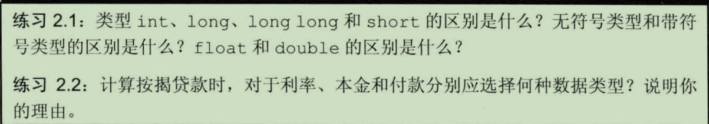

# 第二章 变量和基本类型
## 2.1基本内置类型
C++包括算数类型（字符、整型数、布尔值、浮点数）和空类型（用于特殊的场合，比如函数的返回值类型）
### 2.1.1算数类型
1、bool:T/F
2、字符：基本的字符类型是char，一个char的空间应该确保可以存放机器基本字符集中任意字符对应的数字值。也就是说，一个char的大小和一个机器字节一样。
3、long long是C++11中新定义的，扩展精度浮点数，最小尺寸为10位有效数字
4、多数计算机是以块的方式来处理内存，可寻址的最小内存块称为"字节"，存储的基本单元称为"字"，通常由几个字节组成。

2.1.1节练习：

2.1：
(1)C++语言规定：一个int至少和一个short一样大，一个long至少和一个int一样大,一个long long至少和一个long一样大
(2)带符号类型可以表示整数、负数和0；无符号类型表示>=0
(3)float和double的区别主要体现在精度上，执行浮点运算时用double,因为float通常精度不够而且双精度浮点数和单精度浮点数的计算代价相差无几。
2.2:通常用double7

## 2.1.2类型转换
1. 当我们赋值给无符号类型一个超出它范围的值时，结果是初始值对无符号类型表示数值总数取模后的余数
2. 当我们给带符号类型一个超出它表示范围的值时，结果是未定义的

## 2.1.3字面值常量
1. 整型和浮点型字面值：以0开头的整数代表八进制，以0x或0X开头的代表十六进制数
2. 字符和字符串字面值：字符串字面值的实际长度要比它的内容多1
3. 转义序列：
   有两类字符不能直接使用：1.不可打印字符（退格等等，没有可视的图符）
                         2.有特殊意义的字符
C++规定的转义序列有：
        1. 换行符 \n
        2. 横向制表符 \t
        3. 纵向制表符 \v
        4. 退格符 \b
        5. 回车符 \r
        6. 双引号 \"
        7. 反斜线 \\
也有泛化的转义序列：   
形式如下：\x（16进制）     \(8进制)
    \115(字符M) \x4d(字符M)

4. 指定字面值的类型
5. 布尔字面值(true,false)和指针字面值(nullptr)

(a): Who goes with Fergus?(换行)，string 类型

(b): long double

(c): 无效，因为后缀 f 只能用于浮点字面量，而 1024 是整型。

(d): long double
