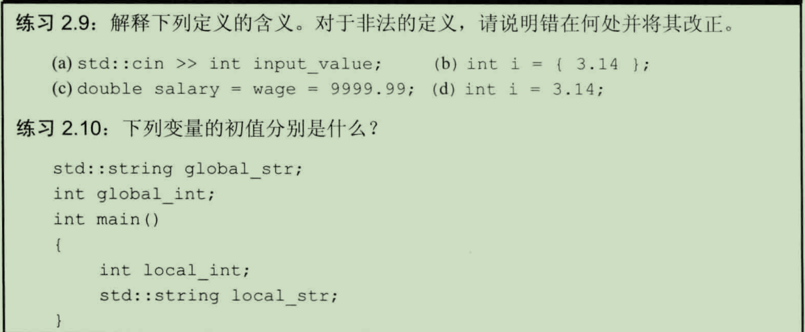
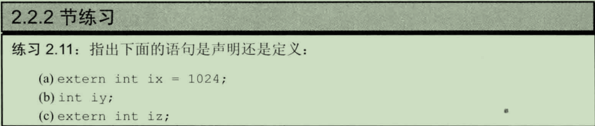
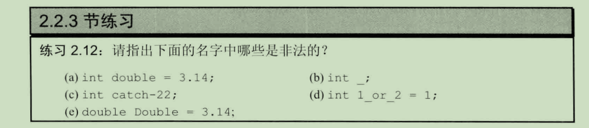
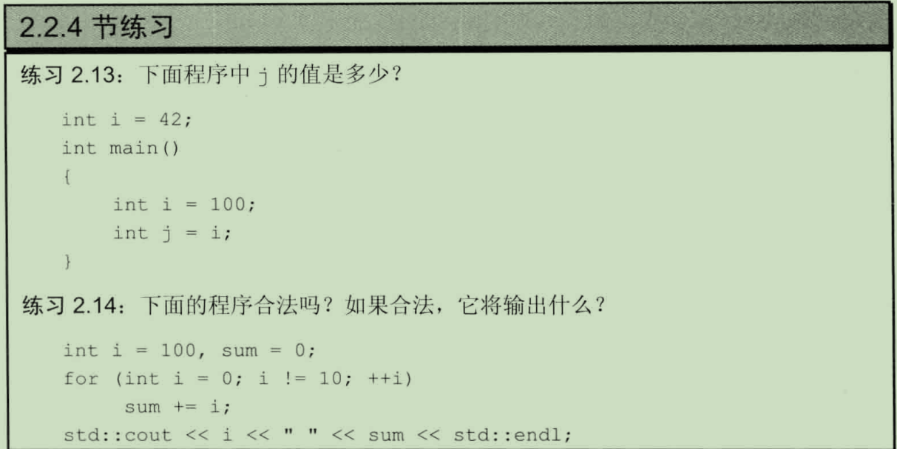

# 2.2变量
## 2.2.1变量定义
初始化不是赋值，初始化的含义是创建变量时赋予其一个初始值，而赋值的含义是把对象的当前值擦除，而以一个新值来替代。

int a{0};    C++11新标准：可以使用花括号初始化变量 ------->列表初始化

默认初始化：默认值到底是什么由变量类型决定，同时定义变量的位置也会对此有影响

定义于函数体内的内置类型的对象如果没有初始化，则其值未定义。类的对象如果没有显式地初始化，则其值由类确定。

2.2.1练习

2.9:
(a)变量应该先定义再使用
(b)用列表初始化内置类型的变量时，如果存在丢失信息的风险，则编译器将报错
(c)wage是未定义的，需要先定义
(d)不报错，小数部分会被截断

2.10：
global_int 是全局变量，所以初值为 0。local_int是局部变量并且没有初始化，它的初值是未定义的。 global_str 和 local_str 是 string 类的对象，该对象定义了默认的初始化方式，即初始化为空字符串。

## 2.2.2变量声明和定义的关系
C++支持分离式编译机制，该机制允许将程序分割成若干个文件，每个文件可被独立编译

变量声明规定了变量的类型和名字，定义同样如此，但是定义还申请内存空间，同时可能为变量赋初值

如果想要声明一个变量而非定义它，需要添加关键字extern，而且不要显式地初始化变量：
extern int i;//声明i而非定义i
int j;//声明并且定义j

extern double pi = 3.14;//定义，extern语句如果包含初始值就是声明了

2.2.2练习

(a)定义
(b)定义
(c)声明

C++是一种静态类型语言，在编译阶段检查类型

## 2.2.3标识符
练习2.2.3

(a), (c), (d) 非法

## 2.2.4名字的作用域
全局作用域、块作用域

输出#3使用作用域操作符来覆盖默认的作用域规则，因为全局作用域本身并没有名字，所以当作用域操作符的左侧为空时，向全局作用域发出请求获取作用域操作符右侧名字对应的变量

2.2.4练习

2.13：j = 100
2.14:合法，i = 100，sum = 45