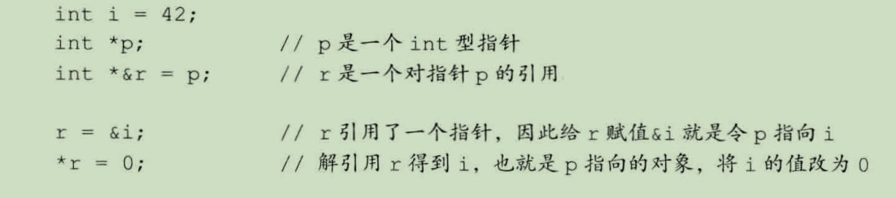

# 2.3 复合类型
## 2.3.1 引用
一般在初始化变量时，初始值会被拷贝到新建的对象中。然而定义引用时，程序把引用和它的初始值绑定在一起，而不是将初始值拷贝给引用。一旦初始化完成，引用将和它的初始化对象一直绑定在一起。因为无法令引用重新绑定到另外一个对象，因此引用必须初始化

Note:引用并非对象，相反的，它只是为一个已经存在的对象所起的另外一个名字。

2.3.1练习


2.15：
(a)合法
(b)不合法，引用必须绑定在对象上，不能和字面值或计算结果绑定在一起
(c)合法
(d)不合法，引用需要初始化

2.16：
(a): 合法。给 d 赋值为 3.14159。
(b): 合法。会执行自动转换（int->double）。
(c): 合法。会发生小数截取。
(d): 合法。会发生小数截取。

2.17：
输出：10，10


## 2.3.2 指针
指针存放某个对象的地址，要想获取该地址，需要使用取地址符&
```C++
int ival = 42;
int *p = &ival  //p存放变量ival的地址
```

如果指针指向了一个对象，则可以使用解引用符*来访问该对象
```C++
int ival = 42;
int *p = &ival;  //p存放变量ival的地址
cout<< *p;
```
解引用操作仅适用于有效指针

在声明语句中，&和*用于组成复合类型；在表达式中，它们又变成了运算符


nullptr是一种特殊类型的字面值

NULL是预处理变量，它的值就是0

任何非0指针对应的条件值都是true

**void*指针：**
void*是特殊的指针类型，可用于存放任意对象的地址，但我们不知道地址中对象的类型

2.3.2练习

2.18：
```C++
int a = 0, b = 1;
int *p1 = &a,*p2 = p1;
p1 = &b;
*p2 = b;
```
2.19:
1. 引用是一个对象的别名，指针本身就是个对象
2. 引用必须初始化，引用无法绑定到其他对象，指针无需在定义时赋值，也可以后期指向其他对象

2.20：
i  = 42^2

2.21:
(a): 非法。不能将一个指向 `double` 的指针指向 `int` 。
(b): 非法。不能将 `int` 变量赋给指针。
(c): 合法。

2.22:
(1)判断p是否为空指针
(2)判断p所指向对象的值是否为0

**2.23：**
不可以，我甚至无法直接判断指针本身是否是合法的（是这样吗？

2.24：
void*可以指向任意对象，其他指针类型必须要与所指对象严格匹配

## 2.3.3 理解复合类型的声明
变量的定义包括一个基本数据类型和一组声明符

指向指针的指针：
```C++
    int a = 1;
    int *pi = &a;//pi指向一个int型的数
    int **ppi = &pi;//ppi指向一个int型的指针
    //如果要输出a的值
    cout<<**ppi;//两次解引用
```

指向指针的引用：



